# Developer Guide

## Acknowledgements

* **SE-EDU Initiative:** The overall architecture of this application (particularly the separation of `Ui`, `Parser`, `Storage`, and `Command` classes) was inspired by the [SE-EDU AddressBook-Level2 and Duke/ip projects](https://se-education.org/), created for software engineering education.
* **Libraries:** Libraries: This project relies solely on standard Java 17 libraries for core execution. [JUnit 5](https://junit.org/junit5/) is used for automated unit testing.

## Design & implementation

<!-- @@author N-SANJAI -->
### Application Architecture, Overview, Offer, Contact, and Help Features

**Author:** Navaneethan Sanjai

#### 1. Main Control Flow & Architecture

`InternTrackr` is the entry point of the application. It ties together the core components and keeps the main loop running until the user decides to exit.

**1.1 Application Startup**

When the app launches, the `InternTrackr` constructor sets up three things: `Ui`, `Storage`, and `ApplicationList`.

* It tries to load any previously saved data from disk via `Storage`.
* If the file doesn't exist yet (e.g. first launch) or the data is corrupted, an `InternTrackrException` is caught internally. The app then starts fresh with an empty list and lets the user know via `Ui`.

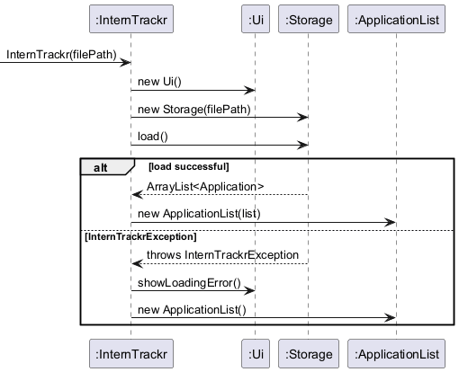

**1.2 Main Command Loop**

After startup, `run()` kicks off the read-parse-execute loop, which keeps going until an `ExitCommand` flips the `isExit` flag to true.

* **Happy Path:** The user types a command, it gets parsed and executed, and the result is shown on screen.

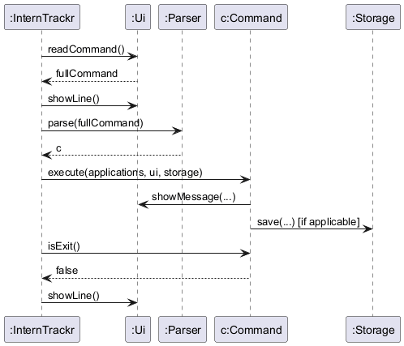

* **Error Path:** If the command is unrecognised or the arguments are malformed, an `InternTrackrException` is thrown. The loop catches it and calls `Ui#showError()` — the app stays running rather than crashing.

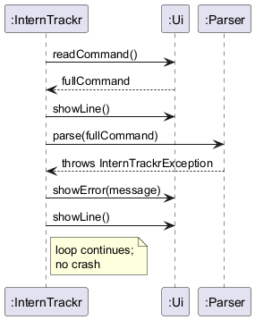

#### 2. UI Component

The `Ui` class owns all terminal interaction — nothing else in the app touches `System.in` or `System.out` directly.

* **Responsibility:** Reading user input via `readCommand()`, and printing messages, dividers, and errors via `showMessage()` and `showError()`.
* **Design Rationale:** Keeping all I/O in one place means commands stay decoupled from the console entirely. This makes writing automated tests much simpler — you just redirect the streams once in test setup and you're done.

#### 3. Overview Feature Implementation

The `overview` command gives users a quantitative snapshot of their internship applications, including a detailed breakdown by stage for active applications.

**Implementation Details:**

The feature is handled by `OverviewCommand`, which extends the abstract `Command` class. Here's what happens when it runs:

1. It queries `ApplicationList` for the current application count (including archived).
2. It iterates through the list, skipping archived applications, and aggregates the frequency of each status using a `LinkedHashMap` to maintain the order defined by `Application.VALID_STATUSES`.
3. It passes the active-only counts to `Ui` under the heading **"Active Status Breakdown"**, making it clear that archived applications are intentionally excluded from the breakdown.
4. Since it is a read-only operation, it never writes to `Storage`.

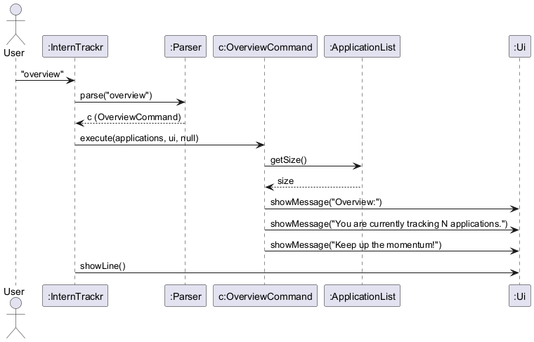

**Runtime State Snapshot:**

The object diagram below shows a representative runtime state when `overview` is run. `app3` is archived, so it is excluded from the Active Status Breakdown even though its `status` field is `"Applied"`. The breakdown correctly shows `Applied: 1, Interview: 1` rather than `Applied: 2`.


#### 4. Offer Feature Implementation

The `offer` command enables users to track their compensation packages while automating the workflow of updating application statuses.

**Implementation Details:**

1. The command takes in the target index and the numerical salary.
2. `OfferCommand#execute()` verifies the index bounds.
3. It updates the `salary` field of the selected `Application`.
4. It checks the application's current status. If the status is not already "Offered", it normalizes and updates the status automatically.
5. `Storage#save()` is triggered immediately to ensure financial data is persistently written to disk.


#### 5. Contact Feature Implementation

The `contact` command allows users to store recruiter details directly alongside a specific application, keeping networking information localized.

**Implementation Details:**

1. The command takes in the target index, the contact name (prefixed by `c/`), and the contact email (prefixed by `e/`).
2. `ContactCommand#execute()` verifies the index bounds against the active (non-archived) applications.
3. It updates the internal state of the selected `Application` with the provided name and email via `setContactDetails()`.
4. `Storage#save()` is triggered immediately to ensure these networking details are securely written to disk and persist across sessions.

**Note on INDEX:** The index always refers to the position shown in the default `list` output (active applications only). The `filter` command affects only the display — it does not alter the underlying list order or the indices used by commands such as `contact`, `status`, or `offer`.


#### 6. Help Feature Implementation

The `help` command is designed to provide users with direct assistance without cluttering the CLI environment.

**Implementation Details:**

The `HelpCommand` invokes `Ui` to display a hardcoded URL to the exhaustive online User Guide. This delegates documentation tracking to the web rather than bloating the internal executable with large text blocks.


#### 7. Advanced Deadline Management (Undone & Delete)

The application's deadline capabilities were expanded to allow users to fully manage the state of their tasks by unmarking completed deadlines or deleting them entirely.

**Implementation Details:**

1. The `DeadlineCommandParser` was updated to securely parse the `undone` and `delete` subcommands, intercepting invalid (non-numerical) indices and preventing Java stack trace leaks (`NumberFormatException`).
2. `DeadlineUndoneCommand` and `DeadlineDeleteCommand` execute by first resolving the active application, then retrieving its `DeadlineList`.
3. Strict bounds-checking is performed on both the application index and the deadline index.
4. For `undone`, the command checks if the deadline is *already* incomplete. If so, it throws an `InternTrackrException` to prevent redundant operations and unnecessary disk writes. Otherwise, it updates the state and invokes `Storage#save()`.
5. For `delete`, the command removes the specific deadline from the internal `DeadlineList` and triggers a save.

#### 8. Strict Date Validation

To ensure data integrity for internship timelines, the date parsing logic for deadlines was overhauled to prevent silent mutations of invalid dates.

**Implementation Details:**

By default, Java's `DateTimeFormatter` uses `ResolverStyle.SMART`, which silently auto-corrects invalid dates (e.g., automatically converting `31-02-2026` to `28-02-2026`).

1. The parser was upgraded to use `ResolverStyle.STRICT` alongside the `uuuu` year format.
2. Additional logic was injected to explicitly evaluate `dueDate.isBefore(LocalDate.now())`.
3. If a user inputs a non-existent calendar date (like Feb 29th on a non-leap year) or a past date, the parser immediately catches it and throws an `InternTrackrException`.

#### 9. UI List Summary Abstraction (`toSummaryString`)

To handle applications accumulating large numbers of deadlines without cluttering the CLI, a new output abstraction was introduced for list-based commands.

**Implementation Details:**

1. A new `toSummaryString()` method was implemented within the `Application` model.
2. Instead of relying on `toString()`—which outputs the raw string representations of all attached `Deadline` objects—`toSummaryString()` dynamically calculates `deadlines.getSize()`.
3. It formats the output cleanly (e.g., `Deadlines: 0 deadlines` or `Deadlines: 2 deadlines`).
4. This abstraction was integrated across `ListCommand`, `ListArchiveCommand`, `FilterCommand`, and `FindCommand` to ensure UI consistency across all list views.

#### 10. Design Considerations

**Aspect: Handling Date Validation for Deadlines**
* **Alternative 1:** Use default `SMART` date parsing.
  * *Pros:* Requires less code and avoids crashing on minor user typos.
  * *Cons:* Causes silent data mutation. If a user accidentally types `31-11-2026`, it saves as `30-11-2026` without warning them, which could lead to missed deadlines.
* **Alternative 2 (Current Choice):** Enforce `STRICT` date parsing and reject past dates.
  * *Reasoning:* Strict validation forces the user to confront typos immediately. In the context of internship hunting, date accuracy is critical, so failing loudly is much safer than failing silently.

**Aspect: Unmarking a Deadline**
* **Alternative 1:** Fail silently if the user tries to mark an already incomplete deadline as undone.
  * *Pros:* Simpler logic.
  * *Cons:* Triggers an unnecessary `Storage#save()` operation for a state that hasn't changed.
* **Alternative 2 (Current Choice):** Throw an exception if the deadline is already undone.
  * *Reasoning:* Provides explicit feedback to the user about the actual state of their tracker and optimizes performance by skipping the disk write.

**Aspect: Handling an empty application list during `overview`**

* **Alternative 1:** Throw an `InternTrackrException` to warn the user there's nothing to show.
* **Alternative 2 (Current Choice):** Display "0 applications" without any fuss.
* **Reasoning:** An empty list is a completely valid state — especially right after first launch. Treating it as an error would just confuse the user unnecessarily.

**Aspect: Passing dependencies to read-only commands (`Overview`, `Help`)**

* **Alternative 1 (Current Choice):** Pass a valid `Storage` reference to every command for consistency.
* **Reasoning:** Since all commands share the same `execute(ApplicationList, Ui, Storage)` interface, the main loop always passes `storage` uniformly. Read-only commands such as `OverviewCommand` and `HelpCommand` simply ignore the `storage` parameter. This keeps the main loop simple and avoids any special-casing based on command type.

* **Alternative 2:** Pass `null` for `Storage` when calling read-only commands.
* **Reasoning against:** Although read-only commands do not use `Storage`, passing `null` would require every call site to know which commands are "read-only", breaking the uniform command interface and risking `NullPointerException` if that assumption ever changes.
---
<!-- @@author -->

<!-- @@author eugenia-cnl-lee -->

### Deadline Feature Implementation

**Author:** Chun Nga Lee

---

#### 1. Deadline Model Design

The deadline feature is built on a model where each `Application` owns a `DeadlineList`,
which contains multiple `Deadline` objects.

The diagram below shows the ownership structure and encapsulation of deadlines:

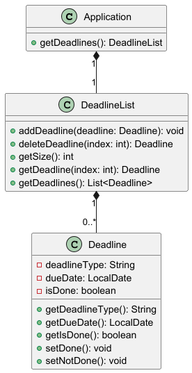

**1.1 Evolution of Design**

**Iteration 1 (v1.0): Single deadline per application**

- `Application` stored a single `Deadline`

*Pros:*
- Simpler implementation
- Minimal changes to model

*Cons:*
- New deadlines overwrite existing ones
- Cannot represent multiple stages
- Prevents `deadline list` feature

**Iteration 2 (v2.0): Multiple deadlines via `DeadlineList` (Current Choice)**

- `Application` stores a `DeadlineList`

*Pros:*
- Supports multiple deadlines
- Enables indexed operations (`list`, `done`)
- Aligns with real-world workflows

*Cons:*
- Requires refactoring across components

**Reasoning:**
A list-based design better models real internship workflows and allows future extensions.

**1.2 Model Constraints**

- `deadlineType` must not be null or blank
- `dueDate` must not be null
- `deadlineType` is trimmed before storage
- `isDone` defaults to `false`
- Deadlines are scoped per application (no global access)
- State modified only via model methods (`setDone()`)

---

#### 2. Deadline Add Feature

The `deadline add` command allows users to attach a new deadline to an application.

**2.1 Implementation**

When `DeadlineAddCommand#execute()` is called:

1. Validates application index
2. Retrieves `Application`
3. Constructs `Deadline`
4. Adds to `DeadlineList`
5. Calls `Storage#save()`

The sequence diagram below shows validation occurring before mutation:


**2.2 Parsing Logic**

The parser performs the following checks:

1. Verifies `add` subcommand is present
2. Verifies `t/` and `d/` prefixes exist
3. Rejects extra arguments (e.g. unsupported prefixes)
4. Parses index as a positive integer
5. Validates date format (`DD-MM-YYYY`)

**2.3 Design Considerations**

**Aspect: Overwrite vs append behaviour**

* **Alternative 1:** Overwrite existing deadline
    + Pros: Simpler implementation
    + Cons: Loses previous deadlines

* **Alternative 2 (Current Choice):** Append to `DeadlineList`
    + Pros: Preserves all deadlines
    + Cons: Requires additional structure
    + **Reasoning:** Preserving historical deadlines is more important than simplicity

  This append-based design also enables other deadline operations such as `deadline delete`,
  where individual deadlines can be removed without affecting others.

**Aspect: Validation strategy**

* **Alternative 1:** Allow partial parsing and validate later
    + Pros: Less strict parser
    + Cons: Risk of invalid command objects

* **Alternative 2 (Current Choice):** Fail-fast validation
    + Pros: Prevents invalid states early
    + Cons: More upfront checks
    + **Reasoning:** Ensures command objects are always valid before execution

  This also ensures consistency across related commands (e.g. `deadline done`), where invalid
  inputs are rejected before any model state is modified.

---

#### 3. Deadline List Feature

The `deadline list` command displays all deadlines for a given application.

**3.1 Implementation**

When `DeadlineListCommand#execute()` is called:

1. Validates application index
2. Retrieves `Application`
3. Retrieves deadlines
4. Displays via `Ui`

The sequence diagram below shows a read-only traversal of the model:


**3.2 Parsing Logic**

The parser performs the following checks:

1. Verifies `list` subcommand
2. Rejects blank input with usage message
3. Parses index as numeric
4. Ensures index is positive

**3.3 Design Considerations**

**Aspect: Inline display vs dedicated command**

* **Alternative 1:** Display deadlines inside `list` command
    + Pros: Fewer commands
    + Cons: Clutters application view

* **Alternative 2 (Current Choice):** Dedicated `deadline list` command
    + Pros: Cleaner separation
    + Cons: Additional command
    + **Reasoning:** Improves readability for applications with multiple deadlines

**Aspect: Ordering of deadlines**

* **Alternative 1:** Sort by date
    + Pros: Chronological order
    + Cons: Hidden logic

* **Alternative 2 (Current Choice):** Preserve insertion order
    + Pros: Predictable behaviour
    + Cons: Not chronological
    + **Reasoning:** Simplicity and transparency preferred

---

#### 4. Deadline Done Feature

The `deadline done` command marks a specific deadline as completed.

**4.1 Implementation**

When `DeadlineDoneCommand#execute()` is called:

1. Validates application index
2. Retrieves `Application`
3. Retrieves `DeadlineList`
4. Validates deadline index
5. Calls `setDone()`
6. Calls `Storage#save()`

The sequence diagram below shows two-level validation before mutation:


**4.2 Parsing Logic**

The parser performs the following checks:

1. Verifies `done` subcommand
2. Verifies `i/` prefix exists
3. Rejects missing or malformed indices
4. Rejects unknown subcommands
5. Ensures both indices are numeric and positive

**4.3 Design Considerations**

**Aspect: Indexing strategy**

* **Alternative 1:** Global deadline index
    + Pros: Shorter commands
    + Cons: Breaks ownership

* **Alternative 2 (Current Choice):** Two-level indexing
    + Pros: Clear ownership
    + Cons: Longer syntax
    + **Reasoning:** Matches user mental model and aligns with per-application deadline storage.

  This structure also supports related operations such as `deadline undone`, which reuses the same
  indexing scheme to reverse completion state without ambiguity.

**Aspect: Handling already-completed deadlines**

* **Alternative 1:** Silently ignore
    + Pros: Simpler
    + Cons: Hides user mistakes

* **Alternative 2 (Current Choice):** Throw exception
    + Pros: Explicit feedback
    + Cons: Slightly stricter
    + **Reasoning:** Prevents silent logical errors and ensures users are aware of redundant actions.

  This behaviour maintains consistency with `deadline undone`, where state transitions are expected
  to be deliberate and explicit rather than silently ignored.

---

#### 5. Display Design

**5.1 `null` vs `-`**

**Earlier design:**
- Displayed `null`

**Current design:**
- Displayed `-`

**Reasoning:**
- Improves readability
- Hides internal representation
- Maintains consistent UX

---

#### 6. Contact Feature (Summary)

The `contact` feature stores recruiter details directly in `Application`.

The diagram below shows contact fields embedded within `Application`:


**6.1 Design Considerations**

**Aspect: Separate class vs inline fields**

* **Alternative 1:** Separate `Contact` class
    + Pros: More extensible
    + Cons: Over-engineering

* **Alternative 2 (Current Choice):** Inline storage
    + Pros: Simpler
    + Cons: Less flexible
    + **Reasoning:** Current requirements do not justify additional abstraction

---

<!-- @@author -->

<!-- @@author Shyamal -->

### Storage, Model, List, and Note Feature Implementation

**Author:** Shyamal

---

#### 1. Storage Component

The `Storage` class is responsible for persisting all internship application data to a
human-editable text file and reloading it when the app starts. This ensures that data
survives between sessions without requiring a database.

**1.1 File Format**

Each application is stored as a single pipe-delimited line in `data/interntrackr.txt`.
The format is as follows:
company | role | status | contactName | contactEmail | salary | note
company | role | status | contactName | contactEmail | salary | note | deadlineType | dueDate | isDone ...

- The first 7 fields are always present. Fields with no value are stored as `-`.
- Each deadline appends 3 additional fields: `deadlineType`, `dueDate`, `isDone`.
- Multiple deadlines are supported by repeating the 3-field group.

This format was chosen because it is human-readable and easy to edit manually,
satisfying the course constraint of using a human-editable storage format.

**1.2 Saving Applications**

When a command modifies the list (e.g. `add`, `delete`, `status`), it calls
`Storage#save()` with the current list. The method writes each application's
`toStorageString()` output as a new line in the file, creating the `data/` folder
if it does not exist yet.

**1.3 Loading Applications**

On startup, `Storage#load()` reads the file line by line and reconstructs
`Application` objects. To keep the method readable and follow SLAP,
the parsing logic is split into focused helper methods:

- `parseLine()` — coordinates field extraction and delegates to helpers
- `parseStatus()` — validates and normalizes the status field
- `parseSalary()` — parses the optional salary field
- `parseNote()` — parses the optional note field
- `parseDeadlines()` — reconstructs `Deadline` objects from remaining fields

Any line with fewer than 7 parts, an unrecognised status, an unparseable date,
or a malformed salary throws an `InternTrackrException` with the corrupted line
number for easy user diagnosis.

The sequence diagram below shows how `Storage#load()` behaves during app startup:

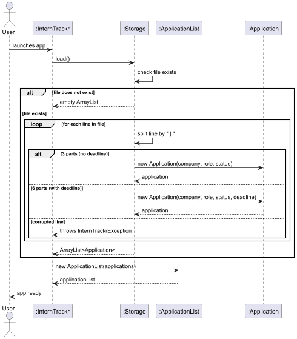

The sequence diagram below shows how `Storage#save()` is triggered after a command executes:

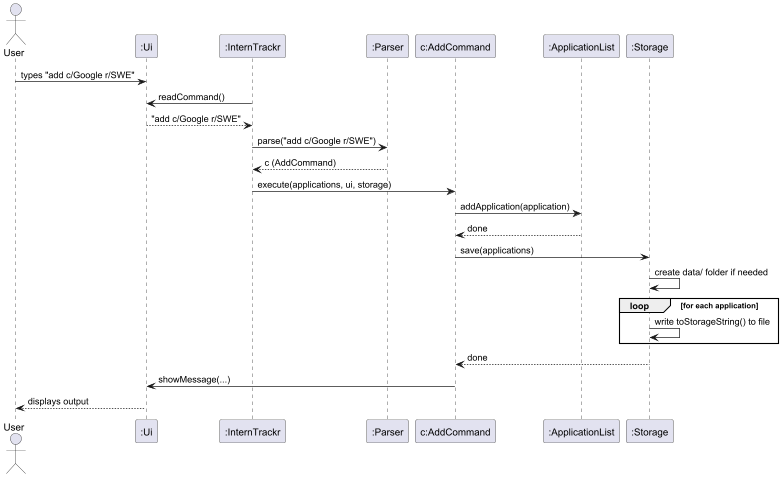

**1.4 Design Considerations**

**Aspect: Storage format for optional fields**

* **Alternative 1:** Store each application and its optional fields (deadline, note, salary)
  as separate lines linked by an index.
  + Pros: Cleaner separation of concerns.
  + Cons: Harder to parse, more error-prone, breaks human-editability.
* **Alternative 2 (Current Choice):** Inline all fields into the same pipe-delimited line,
  using `-` as a placeholder for absent values.
  + Pros: Simple to parse, easy to read and edit manually, single source of truth per application.
  + Cons: Lines grow longer with more fields, but remain readable.

**Aspect: Handling corrupted data**

* **Alternative 1:** Skip corrupted lines silently and continue loading.
  + Pros: App always starts up even with bad data.
  + Cons: Silent data loss — the user would never know entries were dropped.
* **Alternative 2 (Current Choice):** Throw an `InternTrackrException` immediately
  and start with an empty list.
  + Pros: The user is explicitly warned that their data file is corrupted.
  + Cons: All data becomes inaccessible until the user fixes the file manually.
  + **Reasoning:** Transparency about data integrity is more important than convenience.
    The text format makes it easy for the user to inspect and fix the file themselves.

---

#### 2. ApplicationList Defensive Design

The `ApplicationList` class manages the in-memory list of applications. Two key
defensive design decisions were made to prevent misuse by other components.

The class diagram below shows the relationships between the key classes in this author's section:

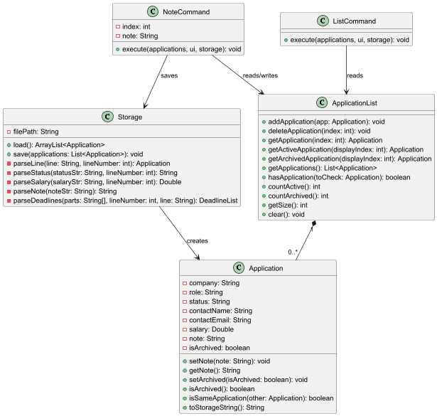

**2.1 Unmodifiable List**

`ApplicationList#getApplications()` returns a `Collections.unmodifiableList()` view
instead of the raw `ArrayList`. This prevents any external caller from directly
adding, removing, or clearing entries without going through the proper methods
(`addApplication()`, `deleteApplication()`), which include bounds-checking and logging.
```java
public List<Application> getApplications() {
    return Collections.unmodifiableList(applications);
}
```

Any attempt to call `.add()` or `.remove()` on the returned list will throw an
`UnsupportedOperationException` at runtime, making misuse immediately visible
during testing.

**2.2 Index Bounds Checking**

Both `getApplication(int index)` and `deleteApplication(int index)` validate the
1-based index before accessing the underlying list. If the index is out of range,
an `InternTrackrException` is thrown with a user-friendly message indicating the
valid range.
```java
if (index < 1 || index > applications.size()) {
    throw new InternTrackrException("Invalid index: " + index
        + ". Please enter a number between 1 and " + applications.size() + ".");
}
```

This prevents `IndexOutOfBoundsException` from propagating up to the user as a
cryptic crash.

`getActiveApplication`(int displayIndex) additionally handles the empty-list case explicitly: when no active applications exist, it throws "No applications found. Start adding some!" instead of the misleading "between 1 and 0" message that would otherwise result from an empty valid range.

---

#### 3. ListCommand and UI Abstraction

**3.1 Implementation**

`ListCommand#execute()` iterates over the `ApplicationList` using 1-based indices
and calls `Ui#showMessage()` for each entry. If the list is empty, a friendly prompt
is shown instead. If an application has a note, it is displayed indented on the
next line beneath the application details, only when non-null and non-blank.

**3.2 Design Rationale: Using `Ui` instead of `System.out`**

An earlier version of `ListCommand` used `System.out.println()` directly. This was
refactored to use `Ui#showMessage()` instead, consistent with every other command
in the codebase.

* **Why it matters:** Commands that bypass `Ui` are untestable — you cannot intercept
  or assert on `System.out` output in JUnit tests without capturing streams.
  By routing all output through `Ui`, tests can subclass `Ui` with a capturing
  override (as seen in `DeadlineAddCommandTest`) to verify output without touching
  the console.

The sequence diagram below shows the full flow of the `list` command:

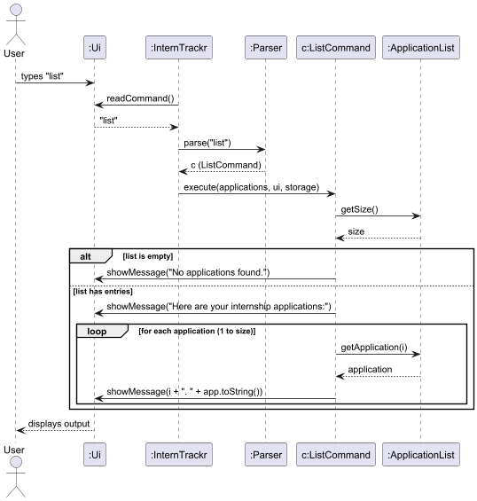

---

#### 4. Note Feature Implementation

The `note` command allows users to attach free-text insights to a specific
internship application. This is useful for recording interview impressions,
tech stack requirements, or any other application-specific details that do not
fit into the structured fields.

**4.1 Implementation Details**

The feature is implemented through `NoteCommand` and `NoteCommandParser`.

**4.1.1 Parsing Logic**

The `NoteCommandParser#parse()` method processes the user input as follows:

1. **Blank Check:** Verifies the argument is not null or blank; throws an
   `InternTrackrException` if so.
2. **Prefix Check:** Verifies the ` n/` prefix is present; throws an
   `InternTrackrException` if missing.
3. **Split:** Splits the argument on ` n/` to separate the index and note content.
4. **Content Check:** Verifies the note content is not blank.
5. **Index Parse:** Parses the index as a positive integer; throws an
   `InternTrackrException` for non-numeric or non-positive values.
6. **Index Validation:** Verifies the index is a positive integer (≥ 1); throws an
   `InternTrackrException` if zero or negative.

**4.1.2 Execution Logic**

When `NoteCommand#execute()` is called:

1. It uses ApplicationList#getActiveApplication(index) to retrieve the target application, which performs bounds checking automatically against the active list.
2. It calls `Application#setNote()` to update the note field, overwriting any
   previously stored note.
3. It immediately calls `Storage#save()` to persist the note to disk.
4. It displays two confirmation messages via `Ui` — the application identity
   and the updated note content.

The sequence diagram below shows the full flow of the `note` command:


**4.2 Design Considerations**

**Aspect: Overwrite vs. append behaviour**

* **Alternative 1:** Append new note content to any existing note.
  + Pros: Users can build up notes over time without retyping previous content.
  + Cons: Notes can grow uncontrollably long and become hard to manage.
* **Alternative 2 (Current Choice):** Overwrite the existing note entirely.
  + Pros: Simple and predictable — the user always knows exactly what the note contains.
  + Cons: Previous note content is lost unless the user manually includes it.
  + **Reasoning:** Overwrite behaviour is simpler to implement, easier to reason about,
    and consistent with how `status` updates work. Users who want to preserve
    previous content can simply re-read the list and retype.

**Aspect: Storing note as a separate file vs. inline**

* **Alternative 1:** Store notes in a separate file indexed by application number.
  + Pros: Keeps the main data file shorter.
  + Cons: Introduces a second file to manage, complicates the storage logic,
    and breaks the single-file human-editable constraint.
* **Alternative 2 (Current Choice):** Store the note inline as a pipe-delimited field.
  + Pros: Keeps all application data in one place, consistent with the existing format.
  + Cons: Notes containing the ` | ` separator could theoretically cause parsing issues,
    mitigated by using ` | ` as the delimiter and restricting notes from containing it.

<!-- @@author -->

---

<!-- @@author Emry -->

---
### Filter, Status, Find and Clear Feature Implementation

**Author:** Emry

### 1. Filter Feature Implementation

The `filter` feature allows users to navigate large lists of applications by isolating entries that match a specific recruitment stage. It also provides a mechanism to reset the view to the full list.

#### 1.1 Implementation Details

The filter feature is implemented through a two-step process: parsing and execution. The `FilterCommandParser` first validates the input and prefix. Once created, the `FilterCommand` iterates through the `ApplicationList`, ignoring archived entries and matching the normalized status against the user's query.

**1.1.1 Parsing Logic**
The `FilterCommandParser#parse()` method handles the initial input processing:
1.  **Empty Check**: Verifies if arguments exist; otherwise, it throws an `InternTrackrException` explaining the correct usage.
2.  **Reset Detection**: Checks if the argument is exactly `clear` (case-insensitive). If so, it returns a `FilterCommand` with the `isClear` flag set to `true`.
3.  **Prefix Validation**: Ensures status-based filters start with the `s/` prefix.
4.  **Cleaning**: Extracts the status string, removes any accidental quotation marks, and trims whitespace before passing it to the command constructor.


**Transition to Execution**
The `FilterCommandParser` acts as a factory that translates raw user input into a configured `FilterCommand` object.
This object encapsulates the validated status string (or the `isClear` flag), which is then passed to the main execution loop.
This separation ensures that the `FilterCommand` itself does not need to know about the s/ prefix or raw string splitting, focusing purely on the filtering logic.

**1.1.2 Execution Logic**
When `FilterCommand#execute()` is called, it performs the following steps:
1.  **Branching**: If the `isClear` flag is active, it calls `handleClearFilter()` to display all non-archived applications.
2.  **Validation**: For status filters, it delegates verification to `Application#isValidStatus()` to ensure the input matches a recognized category: `Applied`, `Pending`, `Interview`, `Offered`, `Rejected`, or `Accepted`.
3.  **Normalization**: It retrieves the "canonical" version of the status (e.g., "iNtErViEw" becomes "Interview") via `Application#getNormalizedStatus()` to ensure a successful match.
4.  **Iteration & Archival Check**: It loops through the `ApplicationList`, first calling `Application#isArchived()` to skip any hidden entries.
5.  **Matching**: For each application, it retrieves the current status via `Application#getStatus()` and compares it with the normalized search term. If they match, the application and its current display index are passed to the `Ui` for display.
6.  **Display**: Matching applications are passed to the Ui along with their current display index.
7.  **Edge Case Handling**: If the loop completes and the `matchCount` is zero, it informs the user via `Ui`.

#### 1.2 Sequence Diagrams

The command iterates through the ApplicationList. It skips archived entries and matches the "normalized" status (Title Case) to ensure consistency.

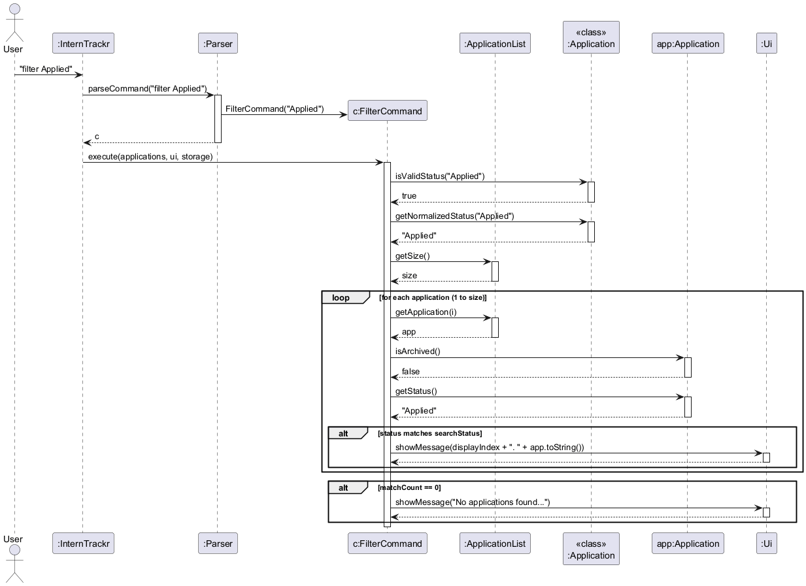

The filter command isolates applications by their current status (e.g., Applied, Interview). FilterCommandParser handles case-insensitivity and strips the s/ prefix.

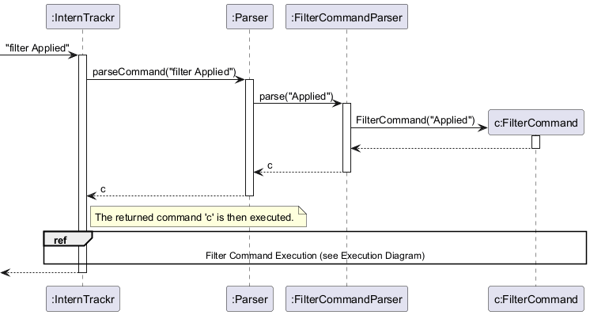

### 1.3 Filter State Snapshot

The following object diagram illustrates a scenario where a user filters for the "Applied" status. In this state, app1 is the only application that will be displayed because it matches the status and is not archived. app2 is excluded due to a status mismatch, and app3 is excluded because it is archived.


#### 1.4 Design Considerations

**Aspect: Normalization vs. Literal Matching**
* **Alternative 1**: Match the user's input exactly against the stored data.
  * *Pros*: Faster execution as no string transformation is needed.
  * *Cons*: If a user types `filter s/applied` but the data is stored as `Applied`, they get zero results, which is counter-intuitive.
* **Alternative 2 (Current Choice)**: Normalize both the input and the comparison target to Title Case.
  * *Reasoning*: This provides a "Search-like" experience where the user does not need to remember exact capitalization, reducing friction.

**Aspect: Filtering Archived Applications**
* **Choice**: Exclude archived applications from the `filter` results.
  * *Reasoning*: This maintains consistency with the default `list` view. Users typically filter to find active tasks; historical data is kept separate in the `list archive` view to avoid cluttering the primary search results.

---

### 2. Status Feature Implementation

The `status` command allows users to update the state of an existing internship application. This is a critical component of the application lifecycle, moving entries from "Applied" toward "Offered" or "Rejected."

#### 2.1 Implementation Details

The `status` feature is handled by `StatusCommand` and `StatusCommandParser`, integrating directly with both the Model and Storage components.

* **Validation**: Rejects empty statuses and enforces a strict whitelist (e.g., Pending, Offered) to keep the `Overview` analytics accurate.
* **Persistence**: Triggers `Storage#save()` immediately after the update to prevent data loss if the user exits abruptly.

**2.1.1 Parsing Logic**
The `StatusCommandParser#parse()` method breaks down the complex command string:
1.  **Delimiter Check**: It looks for the ` s/` prefix. If missing, it throws an error showing the `status INDEX s/STATUS` format.
2.  **Index Extraction**: It splits the string to isolate the index. It attempts to parse this as an `Integer`; if it fails (e.g., the user typed `status first s/...`), it throws a `NumberFormatException` caught and rethrown as an `InternTrackrException`.
3.  **Status Extraction**: It extracts the string after the `s/` prefix, trimming it for processing.

**2.1.2 Execution Logic**
The `StatusCommand#execute()` method follows a strict validation-then-update pipeline:
1.  **Dependency Assertion**: Uses Java `assert` statements to ensure `ApplicationList`, `Ui`, and `Storage` are not null.
2.  **Bounds Validation**: Checks if the provided index is greater than 0 and less than or equal to `applications.countActive()`. If out of bounds, it provides a user-friendly error message showing the valid range.
3.  **Content Validation**: Rejects empty status strings and checks against the master list of valid statuses (Applied, Pending, etc.) via `Application#isValidStatus()`.
4.  **The Update**: Retrieves the target `Application` object and updates its internal status field with the normalized string.
5.  **Immediate Persistence**: Unlike read-only commands, this command immediately calls `storage.save()`. This ensures that the progress is saved to the hard drive instantly.

#### 2.2 Sequence Diagrams

The status command follows a strict validation-then-update pipeline. It ensures the index is within bounds and the status is valid before updating the model and triggering an immediate save to `Storage`. This process is captured in the execution diagram below:

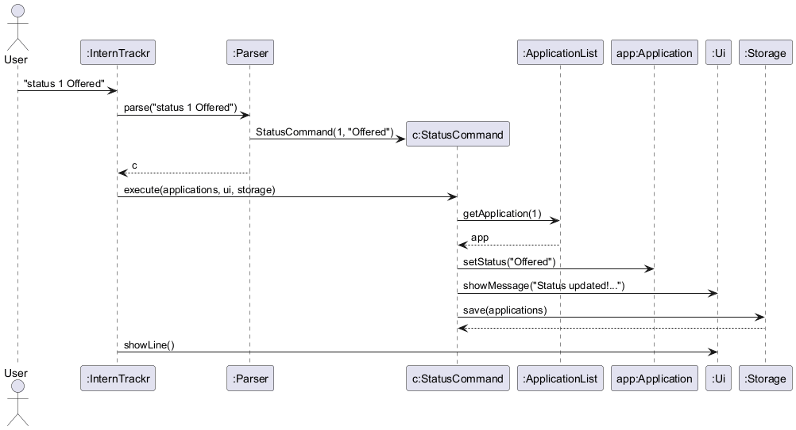

#### 2.3 Design Considerations

**Aspect: Validation of Status Strings**
* **Alternative 1**: Allow any text as a status.
  * *Pros*: Users can create custom statuses like "Waiting for HR."
  * *Cons*: Breaks the `filter` command's ability to categorize data and risks making the storage file messy.
* **Alternative 2 (Current Choice)**: Use a strict whitelist of 6 valid statuses.
  * *Reasoning*: By forcing users into a specific workflow, we ensure the data remains structured enough for the `Overview` and `Filter` features to remain accurate and useful.

**Aspect: Auto-Save vs. Manual Save**
* **Choice**: Triggering `Storage#save()` automatically.
  * *Reasoning*: In a CLI environment, users often exit abruptly. Since status changes represent significant time investments (like receiving an offer), losing that update due to a crash or sudden exit is unacceptable. Auto-saving after every update prioritizes data safety.

### 3. Find Feature Implementation

The `find` feature allows users to search for specific internship applications by matching a keyword against company names and roles. This is essential for navigating large lists efficiently.

#### 3.1 Implementation Details

The feature is implemented through the `FindCommand` and `FindCommandParser` classes.

**3.1.1 Parsing Logic**
The `FindCommandParser#parse()` method processes the user input:
1.  **Trimming**: It removes leading and trailing whitespace from the argument string.
2.  **Validation**: It verifies that the resulting keyword is not empty. If it is, an `InternTrackrException` is thrown with usage instructions.
3.  **Instantiation**: It returns a new `FindCommand` object initialized with the keyword.

**3.1.2 Execution Logic**
When `FindCommand#execute()` is called:
1.  **Normalization**: The search keyword is converted to lowercase to facilitate case-insensitive matching.
2.  **Iteration and Matching**: It loops through the `ApplicationList`. For each application, it checks if the lowercase company name or lowercase role contains the keyword.
3.  **Result Aggregation**: Matching applications and their original 1-based indices are stored in temporary lists.
4.  **Display**:
  * If no matches are found, a "No matching applications found" message is displayed via the `Ui`.
  * If matches exist, the `Ui` displays each matching application preceded by its original index number from the full list.

#### 3.2 Sequence Diagrams

The diagram below shows the interaction between the Parser, Command, and Model during a find operation:

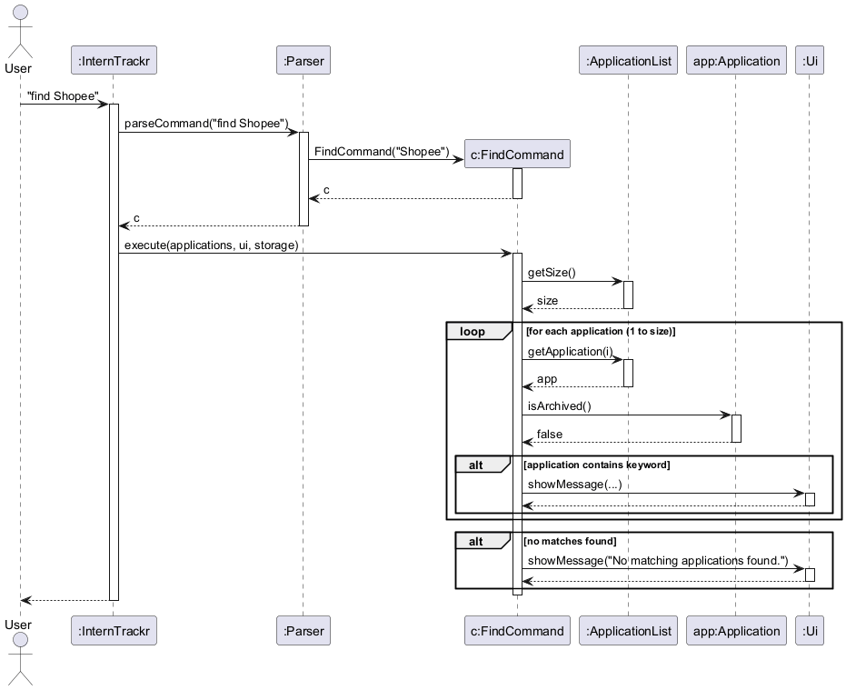

#### 3.3 Design Considerations

**Aspect: Search Scope**
* **Alternative 1**: Search only company names.
  * *Pros*: Faster matching and less visual clutter.
  * *Cons*: Users often want to group applications by role type (e.g., searching "Backend") across different firms.
* **Alternative 2 (Current Choice)**: Search both company and role fields.
  * *Reasoning*: Maximizes utility for the user by allowing them to find applications regardless of which detail they remember.

---

### 4. Clear Feature Implementation

The `clear` command allows users to wipe all stored internship applications to reset the tracker for a new cycle.

#### 4.1 Implementation Details

The feature is handled by the `ClearCommand` class and includes a safety confirmation step.

**4.1.1 Execution Logic**
The `ClearCommand#execute()` method follows a strict confirmation-before-deletion workflow:
1.  **Confirmation Prompt**: It displays a warning asking the user to type "yes" to confirm the action.
2.  **Blocking Input**: It calls `Ui#readCommand()` to wait for the user's specific response.
3.  **Response Validation**: It checks if the response is exactly "yes" (case-insensitive and trimmed).
4.  **Data Wiping**:
  * If confirmed, it calls `applications.clear()` to empty the in-memory list.
  * It immediately invokes `storage.save()` to overwrite the data file on disk with the now-empty list.
  * A success message is displayed.
5.  **Cancellation**: If the input is not "yes", the operation is aborted, and a cancellation message is shown.

#### 4.2 Sequence Diagrams

The diagram below illustrates the confirmation loop and subsequent data clearing process:

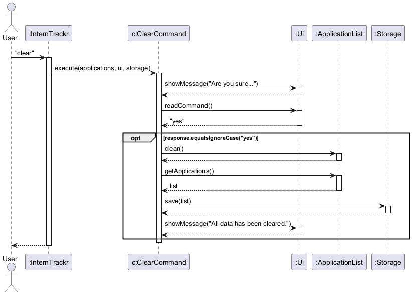

#### 4.3 Design Considerations

**Aspect: Confirmation Mechanism**
* **Alternative 1**: Clear data immediately.
  * *Pros*: Single-step execution for power users.
  * *Cons*: Extremely high risk of accidental data loss, as the command automatically overwrites the storage file.
* **Alternative 2 (Current Choice)**: Two-step confirmation via a sub-prompt.
  * *Reasoning*: Given that `clear` is a destructive and relatively rare operation, prioritizing data safety over speed is the more defensive and user-friendly choice.

<!-- @@author -->

---
<!-- @@author Aarav -->

### Add, Delete, Parser, Archive, List Archive and Unarchive Feature Implementation

**Author:** Aarav

---

#### 1. Class Overview

The diagram below shows the classes involved in Aarav's features and their relationships.

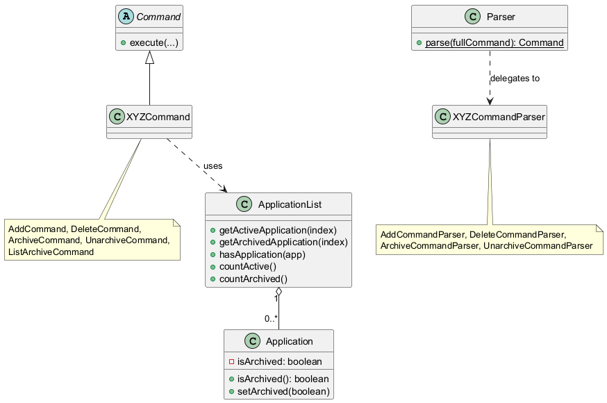

`Parser` acts as a pure dispatcher, delegating argument parsing to dedicated `XYZCommandParser` classes. Each command class operates on `ApplicationList`, which internally manages `Application` objects. The `isArchived` field on `Application` is the shared state that connects the archive, unarchive, list archive, and delete workflows.

---

#### 2. Add Feature Implementation

The `add` feature allows users to create and track a new internship application by specifying the company and role.

##### 2.1 Implementation Details

The feature is implemented through `AddCommandParser` and `AddCommand`.

**2.1.1 Parsing Logic**

The `AddCommandParser#parse()` method processes the user input as follows:

1. It checks that both the `c/` and `r/` prefixes are present.
2. It identifies the positions of the company and role prefixes, allowing either order in the user input.
3. It extracts and trims the company and role values.
4. It removes accidental quotation marks from the parsed values.
5. If either field is missing or blank, it throws an `InternTrackrException`.

**2.1.2 Execution Logic**

When `AddCommand#execute()` is called:

1. It constructs a new `Application` using the parsed company and role.
2. It checks `ApplicationList#hasApplication()` to prevent duplicate entries.
3. If a duplicate is found, it informs the user and exits without saving.
4. Otherwise, it adds the new application to the list and shows confirmation messages through `Ui`. The count shown uses `ApplicationList#countActive()` so that the number reported to the user reflects the active list only, excluding any archived entries.
5. It immediately calls `Storage#save()` so the new application is persisted.

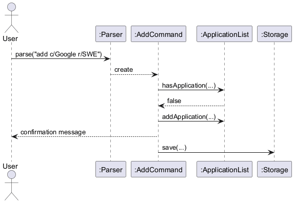

##### 2.2 Design Considerations

**Aspect: Handling duplicate applications**

* **Alternative 1:** Allow duplicate entries.
  * *Pros:* Simpler logic and more flexibility.
  * *Cons:* Users may accidentally track the same application multiple times, making the list unreliable.
* **Alternative 2 (Current Choice):** Reject duplicates before insertion.
  * *Reasoning:* This keeps the tracker clean and prevents avoidable user mistakes.

---

#### 3. Delete Feature Implementation

The `delete` feature removes an active internship application from the tracker.

##### 3.1 Implementation Details

The feature is implemented through `DeleteCommandParser` and `DeleteCommand`.

**3.1.1 Parsing Logic**

The `DeleteCommandParser#parse()` method:

1. Verifies that an index is provided.
2. Checks if the argument begins with the keyword `archive`. If so, sets an `isArchived` flag to `true` and strips the keyword before parsing the remaining index.
3. Rejects any input containing trailing text after the index, showing the correct usage format in the error message.
4. Parses the index as an integer.
5. Rejects non-numeric or non-positive values with an `InternTrackrException`, showing the correct usage format in each case.

This allows both `delete INDEX` (active applications) and `delete archive INDEX` (archived applications) to be supported from a single parser.

**3.1.2 Execution Logic**

When `DeleteCommand#execute()` is called:

1. Based on the `isArchived` flag, it resolves the provided index using either `ApplicationList#getActiveApplication()` (for active deletions) or `ApplicationList#getArchivedApplication()` (for archived deletions). If the active list is empty, a friendly message `"No applications found. Start adding some!"` is shown instead of a misleading range error. If all applications have been archived, the message `"No active applications. Use 'list archive' to view archived ones."` is shown instead. Similarly, when `delete archive INDEX` is used on an empty archive, the message `"There are no archived applications."` is shown.
2. It retrieves the full backing list via `ApplicationList#getApplications()` and performs a linear scan by object identity to find the application's actual position in the backing list.
3. It removes the application from the backing list using `ApplicationList#deleteApplication()`.
4. It displays a confirmation message through `Ui`, using `ApplicationList#countActive()` to show the number of remaining active applications.
5. It immediately calls `Storage#save()` so the deletion is persisted.

This design ensures that the index used by `delete` always matches what the user sees in the corresponding list view (`list` for active, `list archive` for archived).

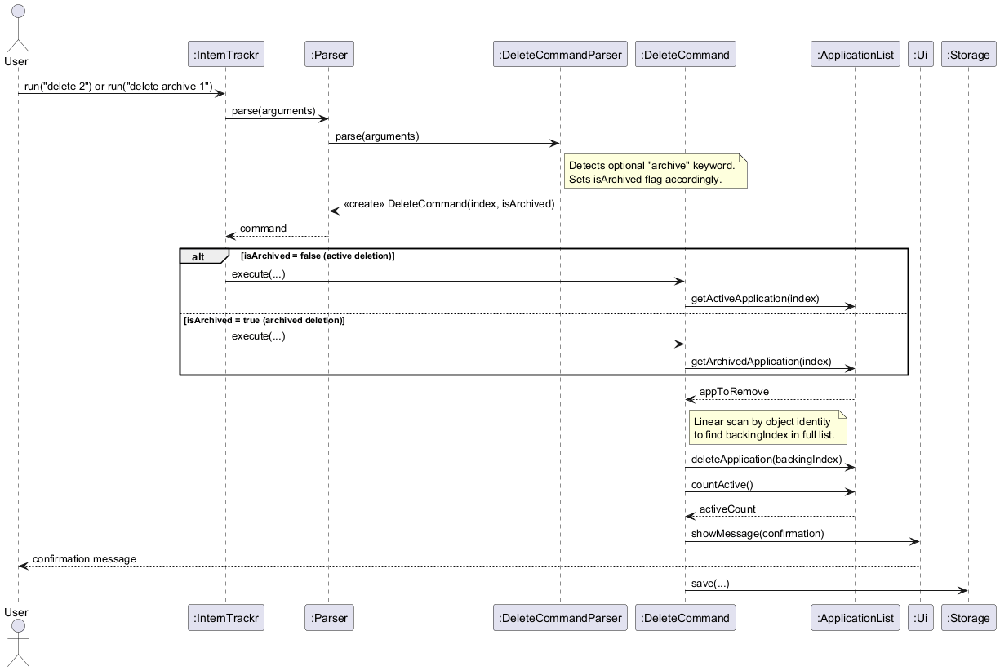

##### 3.2 Design Considerations

**Aspect: Indexing archived vs active applications**

* **Alternative 1:** Delete directly by backing-list index.
  * *Pros:* Simpler internal implementation.
  * *Cons:* The index would not match the default list shown to users once archived entries exist.
* **Alternative 2 (Current Choice):** Resolve the index against the relevant view (active or archived).
  * *Reasoning:* This keeps command behavior consistent with the visible list and reduces user confusion.

**Aspect: Deleting archived applications**

* **Alternative 1:** Require users to unarchive an application before deleting it.
  * *Pros:* Simpler command — only one deletion path.
  * *Cons:* Forces an unnecessary unarchive step, cluttering the active list temporarily just to delete a record.
* **Alternative 2 (Current Choice):** Support `delete archive INDEX` as a first-class command.
  * *Reasoning:* Users sometimes want to permanently discard an archived application without restoring it first. Adding the `archive` keyword keeps it explicit and mirrors the same index the user sees in `list archive`.

---

#### 4. Parser Implementation

The `Parser` component is responsible for dispatching raw user input to the correct command parser or command object.

##### 4.1 Implementation Details

When `Parser#parse()` is called:

1. It validates that the input is not null or blank.
2. It rejects inputs containing the `|` character to protect the storage format.
3. It splits the input into the command word and argument string.
4. It normalizes the command word to lowercase.
5. It uses a `switch` statement to route the input to the correct parser or command constructor.
6. For commands such as `add`, `delete`, `archive`, and `unarchive`, it delegates parsing to `AddCommandParser`, `DeleteCommandParser`, `ArchiveCommandParser`, and `UnarchiveCommandParser` respectively.
7. For `list`, it supports both `list` (returns `ListCommand`) and `list archive` (returns `ListArchiveCommand`). Any other argument after `list` throws an `InternTrackrException`.
8. If the command word does not match any known command, it throws an `InternTrackrException`.

Unlike `add`, `delete`, and `archive`, `list archive` does not use a dedicated parser class. Instead, `Parser` handles it directly because its parsing logic is a simple string equality check.

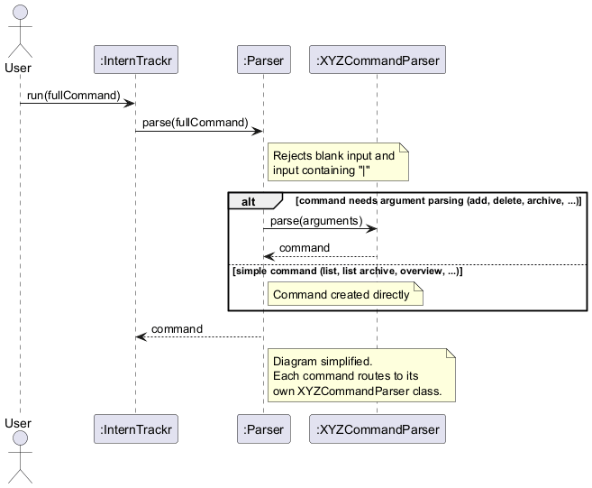

##### 4.2 Design Considerations

**Aspect: Centralized command dispatch**

* **Alternative 1:** Let each feature perform its own top-level command matching.
  * *Pros:* Each feature is more self-contained.
  * *Cons:* Command routing logic becomes duplicated and harder to maintain.
* **Alternative 2 (Current Choice):** Use a centralized `Parser` dispatcher.
  * *Reasoning:* This keeps command recognition in one place and makes the overall control flow easier to understand and extend.

**Aspect: Per-command parser classes vs inline parsing**

* **Alternative 1:** Parse all commands inline inside `Parser.java`.
  * *Pros:* Fewer files and simpler project structure.
  * *Cons:* `Parser.java` grows with every new command, eventually becoming a large monolithic class that is hard to read and test.
* **Alternative 2 (Current Choice):** Delegate to dedicated `XYZCommandParser` classes.
  * *Reasoning:* Keeps `Parser.java` as a thin dispatcher. Each parser class is independently testable, and adding a new command only requires a new file without modifying existing parsing logic.

**Aspect: No dedicated parser for `list archive`**

* **Alternative 1:** Introduce a separate `ListArchiveCommandParser`.
  * *Pros:* Symmetry with the other commands.
  * *Cons:* Adds another class for very little parsing logic — the check is a single `equalsIgnoreCase` call.
* **Alternative 2 (Current Choice):** Handle `list archive` directly inside `Parser`.
  * *Reasoning:* Since the command only checks whether the `list` argument equals `archive`, a dedicated parser would add unnecessary complexity.

---

#### 5. Archive Feature Implementation

The `archive` feature allows users to hide an application from the default list while keeping it in storage.

##### 5.1 Implementation Details

The feature is implemented through `ArchiveCommandParser` and `ArchiveCommand`.

**5.1.1 Parsing Logic**

The `ArchiveCommandParser#parse()` method:

1. Checks that an index is provided.
2. Rejects any input containing trailing text after the index.
3. Parses the index as an integer.
4. Rejects non-numeric or non-positive values with an `InternTrackrException`.

**5.1.2 Execution Logic**

When `ArchiveCommand#execute()` is called:

1. It resolves the provided index against the active applications using `ApplicationList#getActiveApplication()`.
2. It marks the target application as archived by calling `Application#setArchived(true)`.
3. It shows confirmation output through `Ui`.
4. It immediately calls `Storage#save()` so the archived state is persisted.

Once archived, the application no longer appears in the default `list` output, but it can still be viewed with `list archive`.

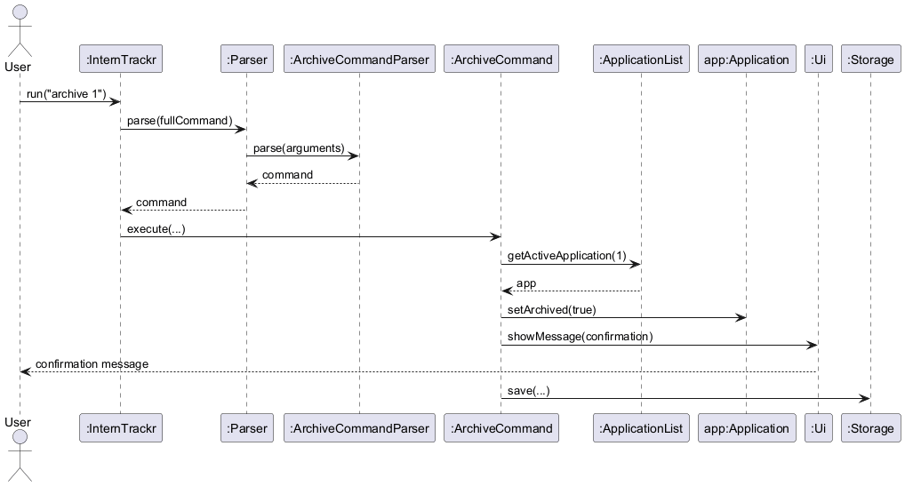

##### 5.2 Design Considerations

**Aspect: Archive vs permanent deletion**

* **Alternative 1:** Delete rejected or inactive applications permanently.
  * *Pros:* Keeps the list short.
  * *Cons:* Users lose historical records that may still be useful for reference.
* **Alternative 2 (Current Choice):** Archive applications instead of deleting them.
  * *Reasoning:* This preserves application history while keeping the active list uncluttered.

**Aspect: Storing `isArchived` in the storage file**

* **Alternative 1:** Store `isArchived` as a plain `true`/`false` field appended to the storage line.
  * *Pros:* Minimal change to the format.
  * *Cons:* Ambiguous — a deadline's `isDone` field is also stored as `true`/`false`, making it impossible for the parser to distinguish the two when the last deadline happens to be completed.
* **Alternative 2 (Current Choice):** Only append `| archived:true` when the application is archived, and omit the field entirely otherwise.
  * *Reasoning:* The `archived:true` token is unambiguous and never conflicts with any other field value. Non-archived applications produce the exact same storage format as before, preserving backward compatibility with existing data files.

---

#### 6. List Archive Feature Implementation

The `list archive` feature displays all archived internship applications.

##### 6.1 Implementation Details

The feature is implemented through `Parser` and `ListArchiveCommand`.

`Parser` directly returns a `ListArchiveCommand` when it detects the input `list archive`.

When `ListArchiveCommand#execute()` is called:

1. It performs a first pass through the full `ApplicationList` to count archived applications.
2. If no archived applications exist, it informs the user and returns immediately.
3. Otherwise, it prints a header and performs a second pass, displaying each archived application with a sequential display index starting at 1.
4. If an archived application contains a note, the note is displayed underneath it.

This feature is read-only and does not call `Storage#save()`.

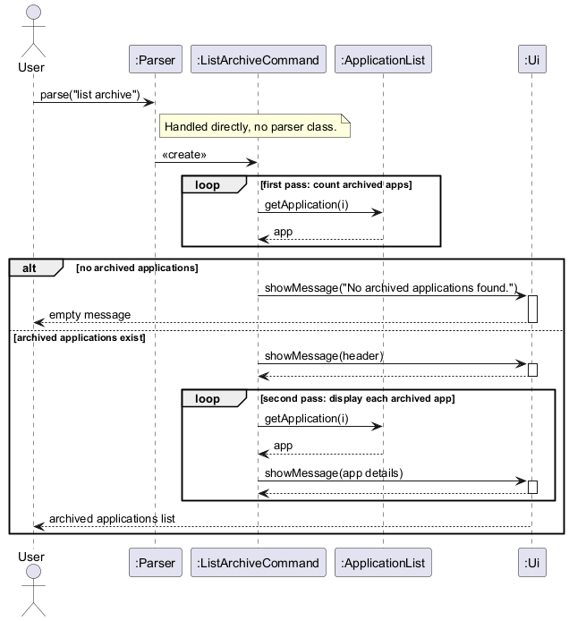

##### 6.2 Design Considerations

**Aspect: Showing archived entries in a separate view**

* **Alternative 1:** Show archived and active applications together in one list.
  * *Pros:* All data is visible in one command.
  * *Cons:* The default list becomes cluttered and less useful for active job tracking.
* **Alternative 2 (Current Choice):** Keep archived entries in a separate `list archive` view.
  * *Reasoning:* This preserves historical data while keeping the primary workflow focused on active applications.

**Aspect: Two-pass vs single-pass iteration**

* **Alternative 1:** Single pass — check count and display in the same loop.
  * *Pros:* Slightly more efficient.
  * *Cons:* The header `"Here are your archived internship applications:"` would need to be printed before knowing whether there are any results, leading to an awkward header followed by an empty message.
* **Alternative 2 (Current Choice):** Two passes — count first, then display.
  * *Reasoning:* Ensures the header is only printed when there are actual results to show, producing cleaner output.


---

#### 7. Unarchive Feature Implementation

The `unarchive` feature allows users to restore a previously archived application back to the active list.

##### 7.1 Implementation Details

The feature is implemented through `UnarchiveCommandParser` and `UnarchiveCommand`.

**7.1.1 Parsing Logic**

The `UnarchiveCommandParser#parse()` method:

1. Checks that an index is provided.
2. Rejects any input containing trailing text after the index.
3. Parses the index as an integer.
4. Rejects non-numeric or non-positive values with an `InternTrackrException`.

**7.1.2 Execution Logic**

When `UnarchiveCommand#execute()` is called:

1. It resolves the provided index against the archived applications using `ApplicationList#getArchivedApplication()`.
2. It restores the target application by calling `Application#setArchived(false)`.
3. It shows confirmation output through `Ui`.
4. It immediately calls `Storage#save()` so the restored state is persisted.

Once unarchived, the application reappears in the default `list` output and no longer appears in `list archive`.

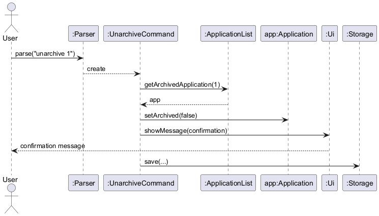

##### 7.2 Design Considerations

**Aspect: Indexing against `list archive` output**

* **Alternative 1:** Resolve the index against the full backing list.
  * *Pros:* Simpler implementation.
  * *Cons:* The index would not match what the user sees in `list archive`, causing confusion.
* **Alternative 2 (Current Choice):** Resolve the index against archived entries only via `ApplicationList#getArchivedApplication()`.
  * *Reasoning:* This keeps `unarchive` consistent with `list archive` — the user uses the same index they see on screen.

**Aspect: Symmetric design with `archive`**

* The `unarchive` command is intentionally symmetric with `archive`. Both resolve their index against the view the user is operating in (`list` for `archive`, `list archive` for `unarchive`), and both immediately persist the change via `Storage#save()`.

<!-- @@author -->

---

## Product scope
### Target user profile

University students applying to many internships who want a quick, simple way to track where each application stands, 
without signing up for yet another website, especially those who prefer typing and shortcuts over messy Excel sheets.

### Value proposition

Students currently use spreadsheets or Notion templates. 
InternTrackr will help internship applicants avoid losing track of many applications by providing a simple way to record and recall each company’s current status and key details. 
Reduces missed deadlines and confusion caused by scattered notes, emails, and messy spreadsheets.

## User Stories

| Version | As a ... | I want to ...                                                    | So that I can ...                                                              |
|---------|----------|------------------------------------------------------------------|--------------------------------------------------------------------------------|
| v1.0    | student  | add a new internship application (company, role)                 | start tracking my progress and keep records in one place                       |
| v1.0    | user     | delete an application                                            | remove entries made in error or that are no longer relevant                    |
| v1.0    | user     | view a list of all applications                                  | see my entire job hunt at a glance                                             |
| v1.0    | user     | edit/update an application status (e.g., Applied → Interview)    | keep my records accurate and see my current progress                           |
| v1.0    | user     | filter applications by status                                    | identify which companies are waiting on me (e.g., "Pending OA")                |
| v1.0    | student  | add deadlines (OAs, submission dates, offer expiries)            | avoid missing critical windows and stay on schedule                            |
| v1.0    | user     | mark a deadline task as done                                     | track completed tasks and maintain my schedule                                 |
| v1.0    | user     | view a summary of my application statuses and upcoming deadlines | quickly assess my overall progress and prioritize what needs attention next    |
| v2.0    | user     | clear all data                                                   | reset the app for a new semester or application cycle                          |
| v2.0    | student  | detect and prevent duplicate applications                        | avoid making professional mistakes with companies                              |
| v2.0    | user     | see total application counts broken down by status               | track if I am meeting my weekly application quotas                             |
| v2.0    | user     | use a `help` command                                             | learn how to use the tool without needing external documentation               |
| v2.0    | user     | archive rejected applications                                    | keep a history of outcomes without cluttering the active view                  |
| v2.0    | student  | add salary and benefit information to an offer                   | compare compensation packages and make informed decisions                      |
| v2.0    | user     | add recruiter contact information to an application              | easily find who to contact for follow-ups                                      |
| v2.0    | user     | add notes to an application                                      | jot down interview thoughts or tech stack requirements                         |
| v2.0    | user     | view all deadlines sorted by date                                | see which deadline is approaching next                                         |
| v2.0    | user     | search for an application by company name                        | find specific details quickly without scrolling through the entire list        |
| v2.0    | user     | add recruiter contact information/email to an application        | find who to contact for follow-ups.                                            |
| v2.1    | user     | mark a completed deadline as undone                              | fix mistakes if I accidentally marked a task as done                           |
| v2.1    | user     | delete a deadline                                                | completely remove cancelled interviews or OAs without deleting the application |

## Non-Functional Requirements

* **Performance**: The application should be able to handle up to 1000 internship applications and their associated deadlines without any noticeable lag in command response time.
* **Reliability (Data Integrity)**: The system must ensure that data is never lost during an abrupt exit; this is achieved by immediately saving to disk after any command that modifies the application state (e.g. `add`, `delete`, `status`, `offer`, `note`, `archive`).
* **Portability**: The application should work on any mainstream OS with Java 17 installed.
* **Efficiency**: A user who is a proficient typist should be able to manage their application list faster via the CLI than they could using a traditional GUI or spreadsheet.

## Glossary

* *Application* - A single entry in the tracker representing a specific internship role at a specific company.
* *Status* - A predefined category representing the current stage of an internship (e.g., Applied, Pending, Interview, Offered, Rejected, Accepted).
* *Archived Application* - An entry that has been hidden from the default list to reduce clutter but is still preserved in storage for historical reference.
* *Deadline* - A specific milestone or task associated with an application, such as an Online Assessment (OA) or an interview date, which can be tracked independently.
* *Normalization* - The internal process of converting user-inputted strings into a canonical Title Case format (e.g., converting "iNtErViEw" to "Interview") to ensure consistent filtering and display.
* *Mainstream OS* - Windows, Linux, Unix, MacOS

## Instructions for manual testing

Given below are instructions to test the app manually.

> **Note:** These instructions only provide a starting point for testers to verify the core application logic. Testers are expected to do more exploratory testing.

### 1. Launch and Shutdown

#### Initial launch

1. Download the latest `internTrackr.jar` file and copy it into an empty folder.
2. Open your command terminal, navigate to the folder, and run the command:

```bash
java -jar internTrackr.jar
````

**Expected:** You should see the welcome message:

```text
Welcome to InternTrackr! Ready to hunt for some internships?
```

#### Shutdown

1. Type `exit` and press Enter.

**Expected:** The app prints a goodbye message:

```text
Bye! Good luck with your internship hunt.
```

The application terminates safely. A `data` folder containing an empty `interntrackr.txt` file should now exist in the same directory.

### 2. Loading Sample Data

To test features like filtering, archiving, and overviews without manually typing dozens of commands, you can load sample data directly into the storage file.

1. Ensure the app is closed.
2. Navigate to the `data` folder and open `interntrackr.txt` in any text editor.
3. Replace the contents of the file with the following valid data strings:

```text
Google | Software Engineer Intern | Applied | - | - | - | Leetcode Hard
Meta | Data Scientist | Interview | - | - | - | - | OA | 2026-10-12 | true
Netflix | Backend Intern | Rejected | - | - | - | - | archived:true
TikTok | iOS Engineer | Offered | Jane Tan | jane@tiktok.com | 6500.0 | -
Apple | Hardware Intern | Pending | - | - | - | -
```

4. Save the file and relaunch the app:

```bash
java -jar internTrackr.jar
```

5. Run the `list` command.

**Expected:** You should see **4 active applications**: Google, Meta, TikTok, and Apple. Netflix should be hidden as it is archived.

### 3. Testing Core Features

With the sample data loaded, you can test the following commands.

#### 3.1 Tracking and Modifying Applications

**Test:**

```text
status 1 s/Interview
```

**Expected:** Google's status changes from `"Applied"` to `"Interview"`.

**Test:**

```text
offer 3 s/7000.50
```

> TikTok is at index 3 in the active list.

**Expected:** TikTok's salary is updated to `$7000.50`.

**Test:**

```text
contact 4 c/Tim Cook e/tim@apple.com
```

**Expected:** Apple's contact details are successfully updated.

**Test:**

```text
note 1 n/Review OOP concepts
```

**Expected:** Google's note is updated and will appear below it in the list view.

#### 3.2 Viewing and Filtering

**Test:**

```text
overview
```

**Expected:** Shows 5 total applications (4 active, 1 archived) and an Active Status Breakdown (e.g., `Interview: 2`, `Offered: 1`, `Pending: 1`).

**Test:**

```text
filter s/Interview
```

**Expected:** Only Google (after the step above) and Meta are listed.

**Test:**

```text
filter clear
```

**Expected:** The filter is removed and all active applications are shown again.

**Test:**

```text
find Intern
```

**Expected:** Lists Google and Apple based on the role names.

#### 3.3 Archiving

**Test:**

```text
archive 1
```

> Archives Google.

**Expected:** Google is removed from the list view.

**Test:**

```text
list archive
```

**Expected:** Shows Netflix and Google.

**Test:**

```text
unarchive 2
```

> Google is at index 2 in the archive list (Netflix is index 1).

**Expected:** Google is restored to the active list view.

#### 3.4 Deadlines

**Test:**

```text
deadline add 2 t/Tech Round d/01-11-2026
```

> Assuming Meta is at index 2 in the active list.

**Expected:** Adds a `Tech Round` deadline to Meta.

**Test:**

```text
deadline list 2
```

**Expected:** Lists the `"OA"` (`Done`) and `"Tech Round"` (`Not Done`) deadlines.

**Test:**

```text
deadline add 2 t/Final Fit Interview d/15-11-2026
```

**Expected:** Adds a third deadline to Meta.

**Test:**

```text
deadline done 2 i/2
```

**Expected:** Marks the `"Tech Round"` deadline as completed `[X]`.

**Test:**

```text
deadline undone 2 i/2
```

**Expected:** Marks the `"Tech Round"` deadline back to incomplete `[ ]`.

**Test:**

```text
deadline delete 2 i/2
```

**Expected:** Completely removes the `"Tech Round"` deadline from Meta. Running `deadline list 2` immediately after should now only show 2 deadlines.

**Test:**

### 4. Testing Error and Data Corruption Handling

#### 4.1 Invalid User Input

**Test:** Type random text like:

```text
hello world
```

**Expected:** Fails gracefully with:

```text
Error: I'm sorry, but I don't know what that command means :-(
```

**Test:**

```text
add c/"Shopee"
```

> Missing role prefix.

**Expected:** Fails with:

```text
Error: Invalid format. Usage: add c/COMPANY r/ROLE
```

**Test:**

```text
offer 1 s/abc
```

> Invalid salary.

**Expected:** Fails with:

```text
Error: Index and salary must be valid numerical values.
```

#### 4.2 Storage File Corruption

1. Close the application.
2. Open `data/interntrackr.txt` and intentionally corrupt a line.

  * For example, delete a `|` separator so a line has fewer than 7 fields.
  * Or change a deadline date to `not-a-date`.
3. Relaunch the application.

**Expected:** The app catches the corruption (via `InternTrackrException`), prevents a fatal crash, and boots safely into an empty list state.
