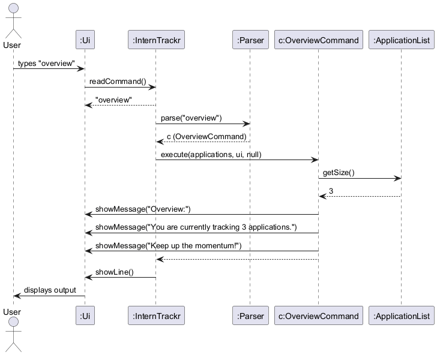
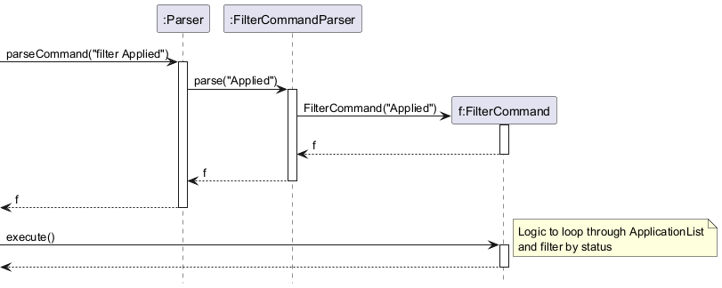
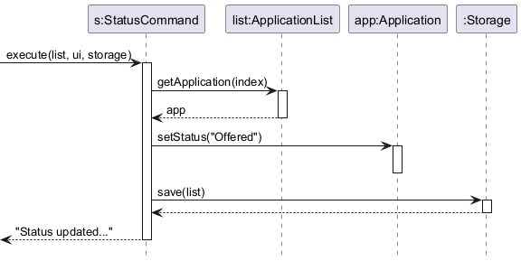

# Developer Guide

## Acknowledgements

{list here sources of all reused/adapted ideas, code, documentation, and third-party libraries -- include links to the original source as well}

## Design & implementation

{Describe the design and implementation of the product. Use UML diagrams and short code snippets where applicable.}

---
<!-- @@author N-SANJAI -->

### Application Architecture and Overview Feature

**Author:** Navaneethan Sanjai

#### 1. Main Control Flow & Architecture

`InternTrackr` is the entry point of the application. It ties together the core components and keeps the main loop running until the user decides to exit.

**1.1 Application Startup**

When the app launches, the `InternTrackr` constructor sets up three things: `Ui`, `Storage`, and `ApplicationList`.

* It tries to load any previously saved data from disk via `Storage`.
* If the file doesn't exist yet (e.g. first launch) or the data is corrupted, an `InternTrackrException` is caught internally. The app then starts fresh with an empty list and lets the user know via `Ui`.


**1.2 Main Command Loop**

After startup, `run()` kicks off the read-parse-execute loop, which keeps going until an `ExitCommand` flips the `isExit` flag to true.

* **Happy Path:** The user types a command, it gets parsed and executed, and the result is shown on screen.


* **Error Path:** If the command is unrecognised or the arguments are malformed, an `InternTrackrException` is thrown. The loop catches it and calls `Ui#showError()` — the app stays running rather than crashing.


#### 2. UI Component

The `Ui` class owns all terminal interaction — nothing else in the app touches `System.in` or `System.out` directly.

* **Responsibility:** Reading user input via `readCommand()`, and printing messages, dividers, and errors via `showMessage()` and `showError()`.
* **Design Rationale:** Keeping all I/O in one place means commands stay decoupled from the console entirely. This makes writing automated tests much simpler — you just redirect the streams once in test setup and you're done.

#### 3. Overview Feature Implementation

The `overview` command gives users a quick snapshot of how many internship applications they're currently tracking.

**Implementation Details:**

The feature is handled by `OverviewCommand`, which extends the abstract `Command` class. Here's what happens when it runs:

1. It queries `ApplicationList` directly for the current application count.
2. It passes that count to `Ui` to format and display the summary.
3. Since it's a read-only operation, it never touches `Storage`.


**End-to-End Execution:**

The diagram below shows the full flow — from the user typing `overview` all the way to the output appearing on screen.



#### 4. Design Considerations

**Aspect: Handling an empty application list during `overview`**

* **Alternative 1:** Throw an `InternTrackrException` to warn the user there's nothing to show.
* **Alternative 2 (Current Choice):** Display "0 applications" without any fuss.
* **Reasoning:** An empty list is a completely valid state — especially right after first launch. Treating it as an error would just confuse the user unnecessarily.

**Aspect: Passing dependencies to read-only commands**

* **Alternative 1:** Pass a valid `Storage` object to every command for consistency.
* **Alternative 2 (Current Choice):** Pass `null` for `Storage` when calling `OverviewCommand`.
* **Reasoning:** Since `OverviewCommand` never writes anything, giving it a live `Storage` reference risks accidental side effects. Passing `null` (guarded by `assert` statements) keeps the execution lightweight and the intent clear.

<!-- @@author -->

---

<!-- @@author Shyamal -->

### Storage, Model, and List Feature Implementation

**Author:** Shyamal

---

#### 1. Storage Component

The `Storage` class is responsible for persisting all internship application data to a
human-editable text file and reloading it when the app starts. This ensures that data
survives between sessions without requiring a database.

**1.1 File Format**

Each application is stored as a single pipe-delimited line in `data/interntrackr.txt`.
There are two possible formats depending on whether a deadline has been set:
```
company | role | status
company | role | status | deadlineType | dueDate | isDone
```

This format was chosen because it is human-readable and easy to edit manually,
satisfying the course constraint of using a human-editable storage format.

**1.2 Saving Applications**

When a command modifies the list (e.g. `add`, `delete`, `status`), it calls
`Storage#save()` with the current list. The method writes each application's
`toStorageString()` output as a new line in the file, creating the `data/` folder
if it does not exist yet.

**1.3 Loading Applications**

On startup, `Storage#load()` reads the file line by line and reconstructs
`Application` objects. The method handles two cases:

* **3 parts** (`company | role | status`) — loads a plain `Application` with no deadline.
* **6 parts** (`company | role | status | deadlineType | dueDate | isDone`) —
  reconstructs a `Deadline` object and attaches it to the `Application`.

Any line with fewer than 3 parts, an unrecognised status, or an unparseable date throws
an `InternTrackrException` with a clear message indicating the corrupted line number.

The sequence diagram below shows how `Storage#load()` behaves during app startup:


The sequence diagram below shows how `Storage#save()` is triggered after a command executes:


**1.4 Design Considerations**

**Aspect: Storage format for deadlines**

* **Alternative 1:** Store each application and its deadline as separate lines,
  linked by an index.
  * Pros: Cleaner separation of concerns.
  * Cons: Harder to parse, more error-prone, breaks human-editability.
* **Alternative 2 (Current Choice):** Inline the deadline fields into the same line
  as the application using additional pipe-separated fields.
  * Pros: Simple to parse, easy to read and edit manually, single source of truth per application.
  * Cons: The line gets longer when a deadline is present, but remains readable.

**Aspect: Handling corrupted data**

* **Alternative 1:** Skip corrupted lines silently and continue loading.
  * Pros: App always starts up even with bad data.
  * Cons: Silent data loss — the user would never know entries were dropped.
* **Alternative 2 (Current Choice):** Throw an `InternTrackrException` immediately
  and start with an empty list.
  * Pros: The user is explicitly warned that their data file is corrupted.
  * Cons: All data becomes inaccessible until the user fixes the file manually.
  * **Reasoning:** Transparency about data integrity is more important than convenience.
    The text format makes it easy for the user to inspect and fix the file themselves.

---

#### 2. ApplicationList Defensive Design

The `ApplicationList` class manages the in-memory list of applications. Two key
defensive design decisions were made to prevent misuse by other components.

**2.1 Unmodifiable List**

`ApplicationList#getApplications()` returns a `Collections.unmodifiableList()` view
instead of the raw `ArrayList`. This prevents any external caller from directly
adding, removing, or clearing entries without going through the proper methods
(`addApplication()`, `deleteApplication()`), which include bounds-checking and logging.
```java
public List<Application> getApplications() {
    return Collections.unmodifiableList(applications);
}
```

Any attempt to call `.add()` or `.remove()` on the returned list will throw an
`UnsupportedOperationException` at runtime, making misuse immediately visible
during testing.

**2.2 Index Bounds Checking**

Both `getApplication(int index)` and `deleteApplication(int index)` validate the
1-based index before accessing the underlying list. If the index is out of range,
an `InternTrackrException` is thrown with a user-friendly message indicating the
valid range.
```java
if (index < 1 || index > applications.size()) {
    throw new InternTrackrException("Invalid index: " + index
        + ". Please enter a number between 1 and " + applications.size() + ".");
}
```

This prevents `IndexOutOfBoundsException` from propagating up to the user as a
cryptic crash.

---

#### 3. ListCommand and UI Abstraction

The `list` command displays all currently tracked applications to the user.

**3.1 Implementation**

`ListCommand#execute()` iterates over the `ApplicationList` using 1-based indices
and calls `Ui#showMessage()` for each entry. If the list is empty, a friendly prompt
is shown instead.

**3.2 Design Rationale: Using `Ui` instead of `System.out`**

An earlier version of `ListCommand` used `System.out.println()` directly. This was
refactored to use `Ui#showMessage()` instead, consistent with every other command
in the codebase.

* **Why it matters:** Commands that bypass `Ui` are untestable — you cannot intercept
  or assert on `System.out` output in JUnit tests without capturing streams.
  By routing all output through `Ui`, tests can subclass `Ui` with a capturing
  override (as seen in `DeadlineCommandTest`) to verify output without touching the console.

The sequence diagram below shows the full flow of the `list` command:


<!-- @@author -->

---

<!-- @@author Emry -->

---
### Filter and Status Feature Implementation

**Author:** Emry

### 1. Filter Feature Implementation

The `filter` feature allows users to navigate large lists of applications by isolating entries that match a specific recruitment stage. It also provides a mechanism to reset the view to the full list.

#### 1.1 Implementation Details

The feature is implemented through the `FilterCommand` and `FilterCommandParser` classes. The logic is designed to be case-insensitive and resilient to user input variations.

**1.1.1 Parsing Logic**
The `FilterCommandParser#parse()` method handles the initial input processing:
1.  **Empty Check**: Verifies if arguments exist; otherwise, it throws an `InternTrackrException` explaining the correct usage.
2.  **Reset Detection**: Checks if the argument is exactly `clear` (case-insensitive). If so, it returns a `FilterCommand` with the `isClear` flag set to `true`.
3.  **Prefix Validation**: Ensures status-based filters start with the `s/` prefix.
4.  **Cleaning**: Extracts the status string, removes any accidental quotation marks, and trims whitespace before passing it to the command constructor.

**1.1.2 Execution Logic**
When `FilterCommand#execute()` is called, it performs the following steps:
1.  **Branching**: If the `isClear` flag is active, it immediately calls `handleClearFilter()` to print every application in the list.
2.  **Validation**: For status filters, it queries `Application#isValidStatus()` to ensure the input matches one of the recognized categories: `Applied`, `Pending`, `Interview`, `Offered`, `Rejected`, or `Accepted`.
3.  **Normalization**: It retrieves the "canonical" version of the status (e.g., "iNtErViEw" becomes "Interview") via `Application#getNormalizedStatus()` to ensure a successful match.
4.  **Iteration**: It loops through the `ApplicationList` using a 1-based index.
5.  **Matching**: For each application, it compares the current status with the search term. If they match, the application is passed to the `Ui` for display.
6.  **Edge Case Handling**: If the loop completes and the `matchCount` is zero, it informs the user that no applications currently hold that status.

#### 1.2 Sequence Diagrams

The diagram below shows the interaction when a user inputs a filter command:


The diagram below shows the internal logic of the `FilterCommand` during execution:



#### 1.3 Design Considerations

**Aspect: Normalization vs. Literal Matching**
* **Alternative 1**: Match the user's input exactly against the stored data.
  * *Pros*: Faster execution as no string transformation is needed.
  * *Cons*: If a user types `filter s/applied` but the data is stored as `Applied`, they get zero results, which is counter-intuitive.
* **Alternative 2 (Current Choice)**: Normalize both the input and the comparison target to Title Case.
  * *Reasoning*: This provides a "Search-like" experience where the user does not need to remember exact capitalization, reducing friction.

---

### 2. Status Feature Implementation

The `status` command allows users to update the state of an existing internship application. This is a critical component of the application lifecycle, moving entries from "Applied" toward "Offered" or "Rejected."

#### 2.1 Implementation Details

The `status` feature is handled by `StatusCommand` and `StatusCommandParser`, integrating directly with both the Model and Storage components.

**2.1.1 Parsing Logic**
The `StatusCommandParser#parse()` method breaks down the complex command string:
1.  **Delimiter Check**: It looks for the ` s/` prefix. If missing, it throws an error showing the `status INDEX s/STATUS` format.
2.  **Index Extraction**: It splits the string to isolate the index. It attempts to parse this as an `Integer`; if it fails (e.g., the user typed `status first s/...`), it throws a `NumberFormatException` caught and rethrown as an `InternTrackrException`.
3.  **Status Extraction**: It extracts the string after the `s/` prefix, trimming it for processing.

**2.1.2 Execution Logic**
The `StatusCommand#execute()` method follows a strict validation-then-update pipeline:
1.  **Dependency Assertion**: Uses Java `assert` statements to ensure `ApplicationList`, `Ui`, and `Storage` are not null.
2.  **Bounds Validation**: Checks if the provided index is greater than 0 and less than or equal to `applications.getSize()`. If out of bounds, it provides a user-friendly error message showing the valid range.
3.  **Content Validation**: Rejects empty status strings and checks against the master list of valid statuses (Applied, Pending, etc.) via `Application#isValidStatus()`.
4.  **The Update**: Retrieves the target `Application` object and updates its internal status field with the normalized string.
5.  **Immediate Persistence**: Unlike read-only commands, this command immediately calls `storage.save()`. This ensures that the progress is saved to the hard drive instantly.

#### 2.2 Sequence Diagrams

The following diagram shows the parsing logic for a status update:



The diagram below illustrates how the command interacts with the Model and Storage components:


#### 2.3 Design Considerations

**Aspect: Validation of Status Strings**
* **Alternative 1**: Allow any text as a status.
  * *Pros*: Users can create custom statuses like "Waiting for HR."
  * *Cons*: Breaks the `filter` command's ability to categorize data and risks making the storage file messy.
* **Alternative 2 (Current Choice)**: Use a strict whitelist of 6 valid statuses.
  * *Reasoning*: By forcing users into a specific workflow, we ensure the data remains structured enough for the `Overview` and `Filter` features to remain accurate and useful.

**Aspect: Auto-Save vs. Manual Save**
* **Choice**: Triggering `Storage#save()` automatically.
  * *Reasoning*: In a CLI environment, users often exit abruptly. Since status changes represent significant time investments (like receiving an offer), losing that update due to a crash or sudden exit is unacceptable. Auto-saving after every update prioritizes data safety.

---

<!-- @@author -->

---


## Product scope
### Target user profile

University students applying to many internships who want a quick, simple way to track where each application stands, 
without signing up for yet another website, especially those who prefer typing and shortcuts over messy Excel sheets.

### Value proposition

Students currently use spreadsheets or Notion templates. 
InternTrackr will help internship applicants avoid losing track of many applications by providing a simple way to record and recall each company’s current status and key details. 
Reduces missed deadlines and confusion caused by scattered notes, emails, and messy spreadsheets.

## User Stories

| Version | As a ... | I want to ...                                                    | So that I can ...                                                           |
|---------|----------|------------------------------------------------------------------|-----------------------------------------------------------------------------|
| v1.0    | student  | add a new internship application (company, role)                 | start tracking my progress and keep records in one place                    |
| v1.0    | user     | delete an application                                            | remove entries made in error or that are no longer relevant                 |
| v1.0    | user     | view a list of all applications                                  | see my entire job hunt at a glance                                          |
| v1.0    | user     | edit/update an application status (e.g., Applied → Interview)    | keep my records accurate and see my current progress                        |
| v1.0    | user     | filter applications by status                                    | identify which companies are waiting on me (e.g., "Pending OA")             |
| v1.0    | student  | add deadlines (OAs, submission dates, offer expiries)            | avoid missing critical windows and stay on schedule                         |
| v1.0    | user     | mark a deadline task as done                                     | track completed tasks and maintain my schedule                              |
| v1.0    | user     | view a summary of my application statuses and upcoming deadlines | quickly assess my overall progress and prioritize what needs attention next |
| v2.0    | user     | clear all data                                                   | reset the app for a new semester or application cycle                       |
| v2.0    | student  | detect and prevent duplicate applications                        | avoid making professional mistakes with companies                           |
| v2.0    | user     | see total application counts broken down by status               | track if I am meeting my weekly application quotas                          |
| v2.0    | user     | use a `help` command                                             | learn how to use the tool without needing external documentation            |
| v2.0    | user     | archive rejected applications                                    | keep a history of outcomes without cluttering the active view               |
| v2.0    | student  | add salary and benefit information to an offer                   | compare compensation packages and make informed decisions                   |
| v2.0    | user     | add recruiter contact information to an application              | easily find who to contact for follow-ups                                   |
| v2.0    | user     | add notes to an application                                      | jot down interview thoughts or tech stack requirements                      |
| v2.0    | user     | view all deadlines sorted by date                                | see which deadline is approaching next                                      |
| v2.0    | user     | search for an application by company name                        | find specific details quickly without scrolling through the entire list     |

## Non-Functional Requirements

{Give non-functional requirements}

## Glossary

* *glossary item* - Definition

## Instructions for manual testing

{Give instructions on how to do a manual product testing e.g., how to load sample data to be used for testing}
